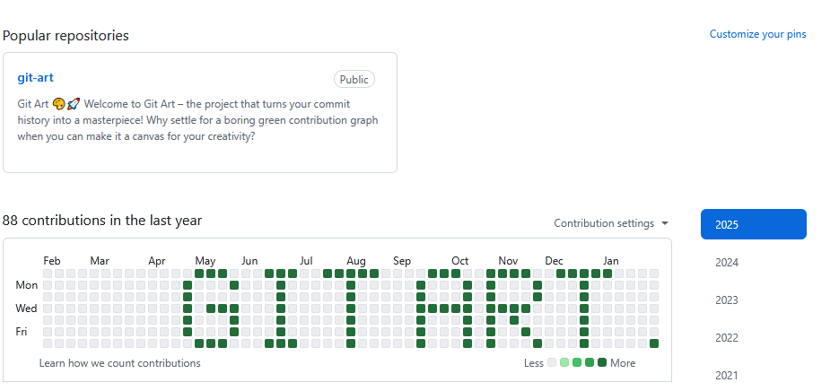
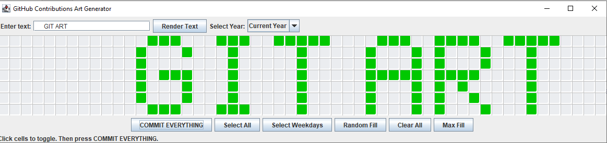

# Git Art 🎨🚀

Welcome to **Git Art** – the project that turns your commit history into a masterpiece! Why settle for a boring green contribution graph when you can transform it into a canvas for your creativity? 😄

---

## What is Git Art?

Git Art is a quirky Java Swing application that lets you "paint" your GitHub contributions by backdating commits. Design your own pattern on your contribution graph—be it doodles, text art, or your latest inside joke—and turn your Git history into an art gallery. 🖌️

---

## Screenshots

### Screenshot 1: GitHub Contribution Graph
  
This screenshot shows a live view of my GitHub profile where the Git Art magic comes to life. Notice how the contribution graph displays the custom pattern along with the text **git art**—a testament to creative coding! 🚀

### Screenshot 2: Git Art Interface
  
Here’s the Git Art application in action. This screenshot captures the intuitive interface where you can type your message (like **git art**) and see it rendered onto the grid. It’s simple, fun, and ready for your next creative commit! ✨

---

## Features

- **Interactive Grid**: A 7×53 grid mimicking GitHub’s contribution chart where you can toggle cells on or off.
- **Text Rendering**: Type in your favorite message (with support for leading spaces to shift the text) and watch it convert into commit art! ✍️
- **Year Modes**: Switch between a dynamic "Current Year" mode (last 365/371 days) and fixed calendar years.
- **State Persistence**: Your grid state is saved for each mode, so switching between years won't erase your hard work.
- **Handy Buttons**:
  - **Select All**: Toggle every cell in the grid.
  - **Select Weekdays**: Toggle only the cells representing weekdays.
  - **Random Fill**: Let randomness take over your art (for those feeling adventurous 🤪).
  - **Clear All**: Erase your art from every mode.
  - **Max Fill**: Go big or go home—fill every cell in every mode!
- **Commit Generation**: Automatically generate commits with backdated timestamps to recreate your art on GitHub.

---

## How It Works

1. **Draw Your Art**: Click on cells in the grid or use the text input (with support for leading spaces) to render patterns.
2. **Choose Your Mode**: Select "Current Year" or a specific calendar year from the dropdown.
3. **Commit Your Creation**: Click **COMMIT EVERYTHING** to generate commits that will display your art on your GitHub profile.
4. **Show Off**: Push your changes to Git and enjoy a contribution graph that’s truly one-of-a-kind! 🎆

---

## Installation

1. **Clone the Repository**
   ```bash
   git clone https://github.com/yourusername/git-art.git

    Import the Project
    Open IntelliJ IDEA and import the project as a Maven project (select the pom.xml file).

    Ensure Git is Installed
    Make sure you have Git installed on your system and properly configured.

    Run the Application
    Execute the GitArtMain class to launch the app and start creating your art!

Disclaimer

Heads Up! This project is all in good fun. While it’s awesome to create commit art, please don’t overdo it or violate any GitHub guidelines. Use your newfound creative power wisely! 😉
Contributing

Feel free to fork the project, open issues, or submit pull requests. Let’s make Git Art even more colorful together! 🌈

Happy coding and may your commits be ever creative! 💻🎨🚀